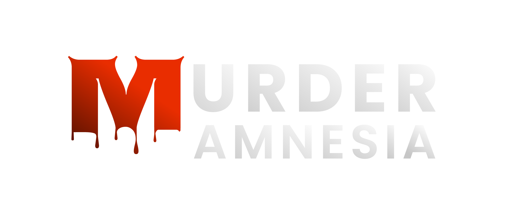
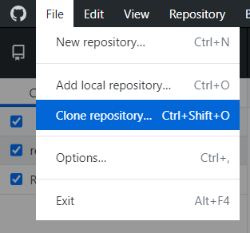
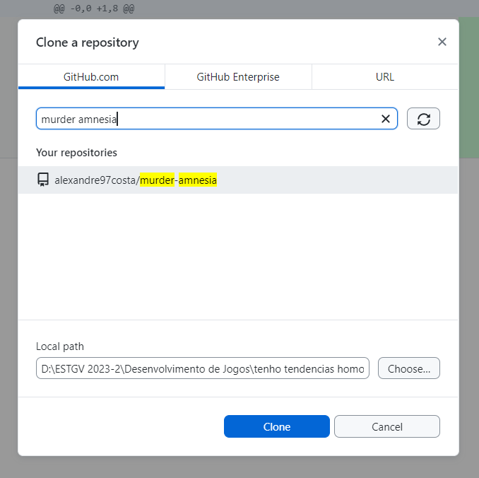
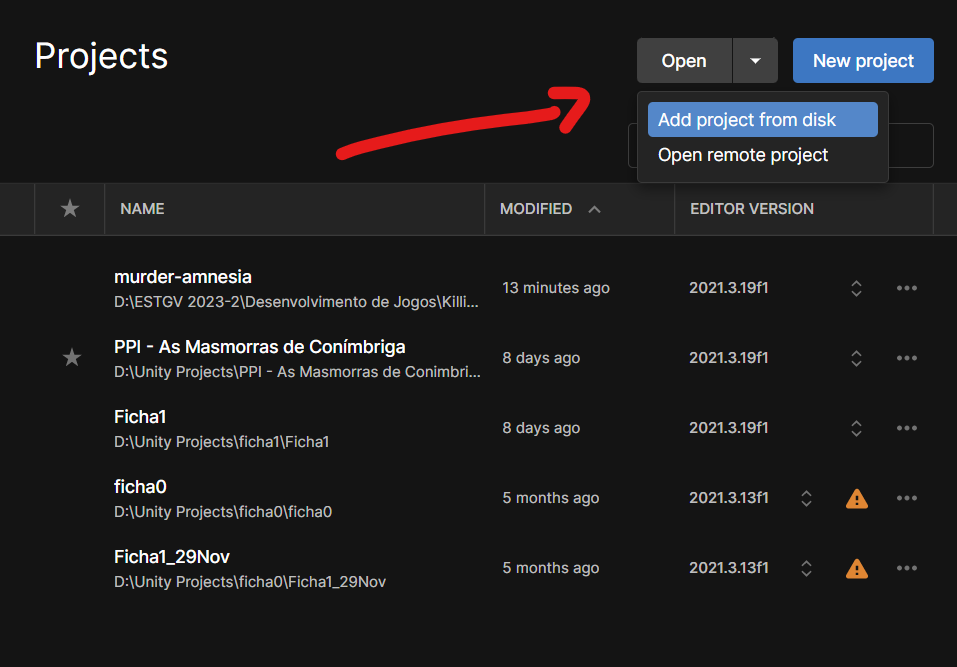
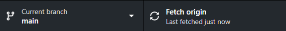

Murder Amnesia é um jogo de plataformas 3D em primeira pessoa, desenvolvido no âmbito da cadeira de Desenvolvimento de Jogos na licenciatura de Tecnologias e Design Multimédia. 

## 👨‍💻 Autores
- [Alexandre Costa](https://github.com/alexandre97costa)
- [Ana Caldeira](https://github.com/anacaldeira98)
- [Constança Fernandes](https://github.com/SirenaCutie)
- [Hugo Gonçalves](https://github.com/cg-Hugo)
- [João Sequeira](https://github.com/JoaoSeque1ra)
- [Raquel Almeida](https://github.com/Raquelmeida)

---

# 🛠 Como usar o repositório pela 1ª vez

### Software Necessário
- Unity (versão 2021.3.19f1) + Hub
- Github Desktop
- Visual Studio

### 1 - Clonar o repositório para uma pasta local

No Github Desktop, ir a File > Clone Repository... 

### 2 - Escolher a pasta de destino

Procurar por Murder Amnesia e escolher uma pasta vazia para ficar como raís do projeto

⚠ É recomendado que escolham um caminho sem letras com acentos ou coisas esquisitas. Isto previne possiveis problemas com builds (ouviste João Çequeira?)

### 3 - Abrir o projeto

Confirma que a pasta que escolheste para o projeto já tem os ficheiros transferidos. Em princípio, se o Github Desktop não estiver num estado de _loading_, deve estar tudo pronto! 🥳

No Unity Hub, clica em Open > 'Add project from disk'

Navega para a pasta que escolheste e _voilá_! O jogo está no teu sistema, pronto a usar. Continua a ler para veres os cuidados a ter no desenvolvimento do jogo.

---

# 🕹 Como usar o repositório pela 376ª vez

### Abre primeiro o projeto no Github Desktop

Atualizar o projeto para a versão mais recente é o passo mais importante para evitar problemas com merges no futuro. Depois de confirmares que está tudo atualizado, aí sim abre o projeto através do Unity Hub. 

_E confirma que estás na branch certa para a tua tarefa!_

### Faz commits frequentes

Isto garante que os outros coleguinhas têm a tua versão nas máquinas deles, e faz com que possiveis problemas com conflitos sejam faceis de resolver por haverem poucas alterações. Mas nem 8 nem 80! Não faças um commit por cada linha de código que mudas, mas também **não fiques mais de 30 mins sem publicar** as tuas alterações.

### Evita alterações em ficheiros de outros

A maior causa de conflitos nos commits é a alteração de um ficheiro por duas pessoas diferentes, por isso deve ser evitado ao máximo. Se tens a mesma tarefa que outra pessoa, tenta dividir a tarefa em tarefas mais pequenas, ou façam pair-programming (dois devs num pc).

---

_Chegaste ao fim!_ 

